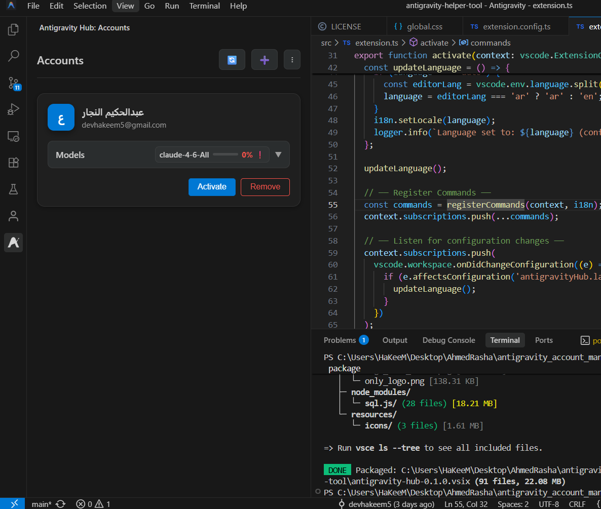

# Antigravity Hub

  
  

  

*[🌍 Scroll down for the Arabic version | النسخة العربية بالأسفل](#النسخة-العربية)*

**Antigravity Hub** is the ultimate companion extension for users of the Antigravity desktop application. Designed to supercharge your workflow, this tool provides seamless multi-account management directly within VS Code, eliminating the hassle of manual logins.

## ✨ Features

- **Multi-Account Management:** Add and store multiple Google accounts securely.
- **One-Click Seamless Switching:** Switch between active Antigravity accounts instantly from the sidebar. No need to constantly log in and out.
- **Real-Time Credit Monitoring:** Keep an eye on your remaining credits across all available models (Claude, Gemini, etc.) directly in VS Code.
- **Secure Export & Import:** Backup your configured accounts and sessions securely and move them across different workspaces or devices.
- **Bilingual UI:** Fully localized interface supporting both English and Arabic, seamlessly adapting to your editor's configuration.

## 🚀 Prerequisites

To use this extension, you **must** have the core Antigravity application installed on your machine.

- **Minimum Supported Version:** Antigravity `v1.23.2` or newer.
- Please ensure you launch Antigravity and log in at least once before using this extension.

## 💻 Usage

1. Open the **Antigravity Hub** panel from the VS Code Activity Bar (sidebar).
2. Click **Add Account** to authenticate securely via your browser.
3. Once added, you can monitor the remaining credits and model availability.
4. Click **Activate** on any account to instantly inject its session into the Antigravity database. VS Code will safely reload to reflect the active account.

## 🤝 Support & Feedback

If you encounter any issues, bugs, or have feature requests, please check out the repository or reach out via email:
- 🐛 **Issue Tracker:** [GitHub Issues](https://github.com/devhakeem5/antigravity-hub-extension/issues)
- 💻 **Repository:** [GitHub](https://github.com/devhakeem5/antigravity-hub-extension)
- 📧 **Email:** [devhakeem5@gmail.com](mailto:devhakeem5@gmail.com)

---

 

<h1 id="النسخة-العربية" dir="rtl">أداة مساعد Antigravity</h1>

تُعد **أداة مساعد Antigravity** الرفيق المثالي لمستخدمي تطبيق Antigravity المكتبي. صُممت هذه الإضافة خصيصاً لتسريع بيئة عملك من خلال توفير إدارة سلسة لعدة حسابات مباشرة من داخل محرر VS Code، مما يقضي على عناء تسجيل الدخول والخروج اليدوي.

  

## ✨ الميزات الرئيسية

- **إدارة حسابات متعددة:** إضافة وتخزين عدة حسابات Google بأمان.
- **تبديل سلس بنقرة واحدة:** يمكنك التبديل بين حسابات Antigravity النشطة فوراً من الشريط الجانبي دون الحاجة لإعادة المصادقة.
- **مراقبة الأرصدة لحظياً:** تتبع الأرصدة المتبقية لجميع النماذج المتاحة (Claude, Gemini، وغيرها) ومعرفة مواعيد تجديدها بسهولة.
- **تصدير واستيراد آمن:** إمكانية أخذ نسخة احتياطية من حساباتك وجلساتك لنقلها بين الأجهزة المختلفة بأمان.
- **واجهة ثنائية اللغة:** تدعم الإضافة اللغتين العربية والإنجليزية بشكل كامل، وتتأقلم تلقائياً مع إعدادات المحرر لديك.

## 🚀 المتطلبات المسبقة

لاستخدام هذه الإضافة بنجاح، **يجب** أن يكون تطبيق Antigravity الأساسي مثبتاً على جهازك.

- **الحد الأدنى للإصدار المطلوب:** تطبيق Antigravity إصدار `1.23.2` فما أحدث.
- يُرجى تشغيل تطبيق Antigravity وتسجيل الدخول مرة واحدة على الأقل قبل بدء استخدام هذه الإضافة حتى يتم إنشاء قاعدة البيانات الخاصة به.

## 💻 طريقة الاستخدام

1. افتح لوحة **Antigravity Hub** من الشريط الجانبي في VS Code.
2. انقر على **إضافة حساب (Add Account)** للمصادقة بشكل آمن عبر المتصفح.
3. بمجرد إضافته، ستتمكن من رؤية الرصيد المتبقي والنماذج المتاحة للحساب.
4. اضغط على زر **تنشيط (Activate)** بجوار أي حساب ليتم نقل الجلسة فوراً إلى قاعدة بيانات Antigravity. (سيعيد المحرر تحميل نفسه بأمان لتطبيق الحساب الجديد).

## 🤝 الدعم الفني

إذا واجهت أي مشاكل فنية، أو كان لديك استفسارات أو مقترحات للتطوير، نرحب بمساهماتك في المستودع أو التواصل عبر البريد الإلكتروني:
- 🐛 **التبليغ عن مشكلة:** [GitHub Issues](https://github.com/devhakeem5/antigravity-hub-extension/issues)
- 💻 **رابط المستودع:** [GitHub](https://github.com/devhakeem5/antigravity-hub-extension)
- 📧 **البريد الإلكتروني:** [devhakeem5@gmail.com](mailto:devhakeem5@gmail.com)
